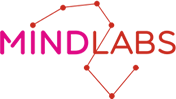
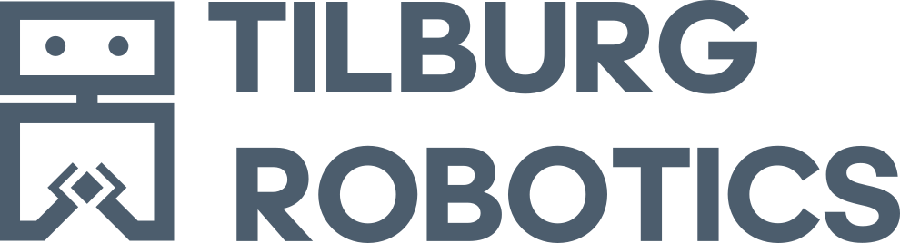

Since their inception, Artificial Intelligence and Robotics have been intrinsically connected. Yet, the two communities are not always interacting as much as they should. The increasing specialization within each field tends to overlook their deeper link, posing challenges in keeping up to date with each other's advancements. This highlights the critical need for an interdisciplinary forum to harmonize efforts across both domains.  

Additionally, many research labs lack access to essential resources. This includes both the high-cost robot hardware required for practical application of theories and the computational resources necessary for training large neural networks. By fostering collaborations between AI and robotics researchers, we can significantly enhance research efficiency and accelerate scientific breakthroughs.  

We organize the <b>AI for Robotics Workshop</b> to provide an opportunity for AI researchers and roboticists to come together and exchange ideas, learn about the latest developments in both fields, encourage networking, and initiate collaborations.  

The workshop is organized as a one day event in Tilburg, The Netherlands, featuring invited talks on the latest advances in both AI and Robotics from leading researchers. To promote meaningful exchanges, the event includes networking opportunities during lunch and coffee breaks, and ends with relaxed social drinks at the end of the day.  

Understanding the importance of inclusive participation, we are pleased to offer free registration for the workshop, kindly provided by our sponsors. This includes a delightful lunch and all-day snacks and drinks. Additionally, we are committed to supporting the involvement of early-career researchers and students by providing a number of travel grants based on need and merit.

Everybody is encouraged to submit and present a poster. Topics of interest include, but are not limited to:
* deep learning for robotics
* foundation models (e.g., LLMs, Open X-Embodiment, etc...)
* human-robot interaction
* robot learning
* dexterous manipulation
* humanoid robotics
* deep reinforcement learning
* imitation learning
* bio-inspired robotics
* neuro-symbolic AI
* computer vision (for robotics)
* swarm robotics
* trustworthy AI
* AI safety

## Invited Speakers

* [Francesco Nori](https://scholar.google.com/citations?user=t3l8q6gAAAAJ) (Google DeepMind)
* [Roberto Calandra](https://lasr.org/) (TU Dresden)
* [Sergey Levine](https://people.eecs.berkeley.edu/~svlevine) (UC Berkeley)
* [Jens Kober](http://www.jenskober.de) (TU Delft)
* [Guido de Croon](http://www.bene-guido.eu/wordpress/) (TU Delft)
* [Silvia Tolu](https://www.dtu.dk/english/Person/cwis?id=102697&tab=1&entity=profile) (DTU)

## Schedule

Tentative. **In Central European Time (CEST; Amsterdam Time)**.

| 9:00-9:15  | Opening Remarks  |
| 9:15-10:00 | Invited Talk #1  |
| 10:00-10:30 | Invited Talk #2  |
| 10:30-11:30 | Coffee break with poster session |
| 11:30-12:00 | [Silvia Tolu](https://www.dtu.dk/english/Person/cwis?id=102697&tab=1&entity=profile)  |
| 12:00-12:30 | Invited Talk #4  |
| 12:00-13:30 | Lunch with networking via thematic tables |
| 13:30-14:00 | Invited Talk #5  |
| 14:30-15:00 | Invited Talk #6  |
| 15:00-15:45 | Coffee break with poster session  |
| 15:45-16:30 | Panel discussion  |
| 16:30-17:00 | Invited Talk #7: [Sergey Levine](https://people.eecs.berkeley.edu/~svlevine)  |
| 17:00-17:10 | Closing remarks  |
| 17:00-19:00 | Drinks and networking  |

 

## Organizers

* [Giacomo Spigler](http://www.spigler.net/giacomo)
* [Murat Kirtay](http://www.crossvalidate.me)

## Registration

Due to capacity constraints at the venue of the workshop, **we kindly ask all participants to register their participation at [registration-link](https://app.gomry.com/event/FymM05lNhqjfXlpddxgd)** .

Further information about event recording and/or live-streaming will follow.

## Important Dates

*   <strike>Travel grant application deadline: **March 1, 2024** (AOE)</strike>
*   <strike>Travel grant notification : **March 5, 2024** (AOE)</strike>
*   Poster submission deadline: **March 5, 2024** (AOE)
*   Workshop Date: **April 5, 2024**

## Venue

The AI for Robotics Workshop will be hosted at the beautiful new **[MindLabs](https://www.mind-labs.eu/)** building in **Tilburg, The Netherlands**, a few blocks from Tilburg Central Station. The venue is easily accessible by train from all Netherlands, Belgium, and Germany. The nearby airports of Eindhoven (base of Ryanair and low-cost airlines) and Amsterdam Schiphol and well connected to Tilburg by train.

<iframe src="https://www.google.com/maps/embed?pb=!1m18!1m12!1m3!1d2183.4285681834876!2d5.082960790384151!3d51.56137862591535!2m3!1f0!2f0!3f0!3m2!1i1024!2i768!4f13.1!3m3!1m2!1s0x47c6bf2ba7a333a3%3A0x120bd825d562f2f!2sMindLabs!5e0!3m2!1sen!2snl!4v1704545609285!5m2!1sen!2snl" width="600" height="450" style="border:0;" allowfullscreen="" loading="lazy" referrerpolicy="no-referrer-when-downgrade"></iframe>

## Call for Posters

We encourage attendees to present a poster at the workshop. Please indicate your interest in presenting a poster during registration.

Participants must present a poster to qualify for the travel grants.

## Contact

You can reach the organizers for any questions by contacting them individually, or through the dedicated email set up for the workshop:

workshop &lt; at &gt;  tilburg-robotics.eu

## Sponsors

 &nbsp;&nbsp;

 &nbsp;&nbsp;

 &nbsp;&nbsp;

 &nbsp;&nbsp;

[Please contact us if you wish to sponsor additional travel grants!]

<!-- Google tag (gtag.js) -->

<!--
Text can be **bold**, _italic_, or ~~strikethrough~~.

-->

